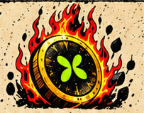

# BURNEPEP 网页素材接入说明

请使用本文件夹的本地图像资源制作网页，不要重新生成插画。以 `asset-manifest.json` 为文件路径与尺寸的唯一依据，以 `site-copy.json` 为正文参考。

首屏已有视频，本包不提供首屏视觉替代品；保留现有视频接入位置。公共导航可以独立实现。后续依次为 Manifesto、Token Highlights、Community、Roadmap、底部 CTA、Footer。

正常文字应使用 HTML，不要全部使用截图。四张 Token 卡片分别有完整卡片、独立插画、标题和正文参考；社区区有完整拼贴与可见单元素；路线图有四张卡片、四个图标和箭头。`00_sections` 仅用于检查布局与做旧边缘。

所有原图切片均未放大。使用小图时不要强行拉伸成大图。透明素材只是后期抠图，优先对照矩形原图确认轮廓。原图里缺失或被遮挡的部分不要声称已经恢复。外部链接和视频地址尚未提供，请保留明确待填项，不得杜撰。

图片调用示例：
```html
<picture>
  <source srcset="webp/03_token/T11_burn-mechanic-art.webp" type="image/webp">
  
</picture>
```
